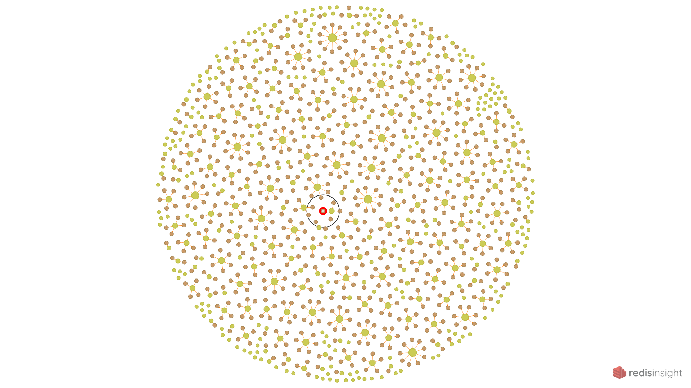
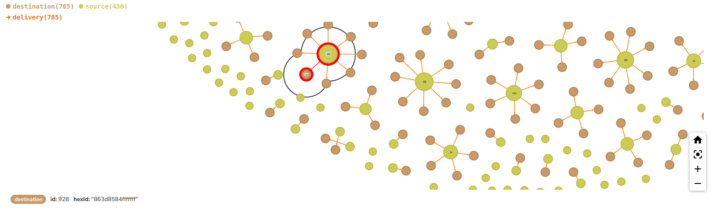

### Delivery Pickup Analysis with Food Delivery Data

#### Setup OSRM with Docker (with the help of steps in https://hub.docker.com/r/osrm/osrm-backend/)

Food Delivery Dataset is on India map, so to get India information from OSRM first:

```angular2html
wget http://download.geofabrik.de/asia/india-latest.osm.pbf
```
File is in **<project_dir>/data**. project_dir is also current directory. To do so extract information from installed **_osm.pbf_** file:
```
docker run -t -v "${PWD}/data:/data" osrm/osrm-backend osrm-extract -p /opt/car.lua /data/india-latest.osm.pbf
```

After that, run:

```
docker run -t -v "${PWD}/data:/data" osrm/osrm-backend osrm-partition /data/india-latest.osrm
docker run -t -v "${PWD}/data:/data" osrm/osrm-backend osrm-customize /data/india-latest.osrm
```
**Note:** There must be enough space to execute Docker commands in your machine, otherwise Docker will exit with code **137 (out of memory)**.

- System Information <br><br>

    

Up OSRM backend with (in detach mode):
```
docker run -t -d -i -p 5000:5000 -v "${PWD}/data:/data" osrm/osrm-backend osrm-routed --algorithm mld /data/india-latest.osrm
```
- The meaning of .osm is OpenStreetMap and .pbf file is an alternative to XML format, has smaller size. 
It is used for GIS transfer.

#### Redis Graph for Delivery Grouping, Connections and Visualization

Example group result:


Example RedisGraph:



Example RedisGraph Node Structure with Delivery Durations Median Value:




**A new Redis Graph would be created for each hour but there is no enough data.**