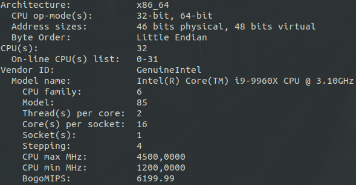
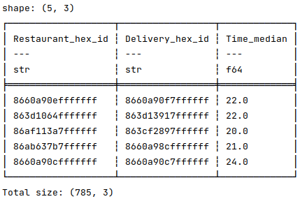
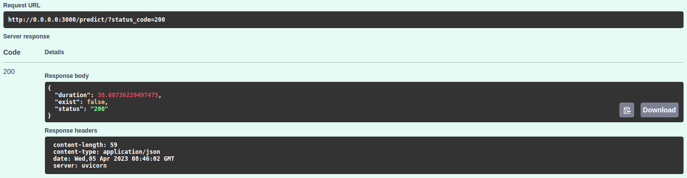
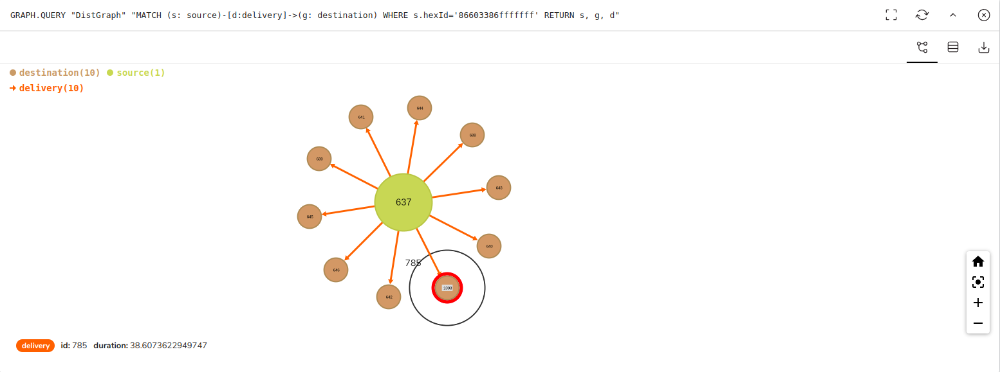
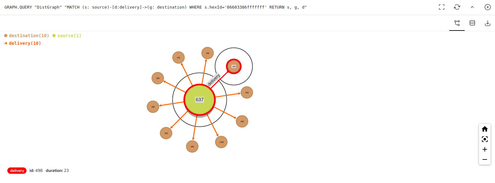
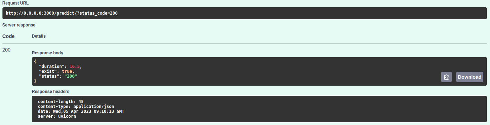
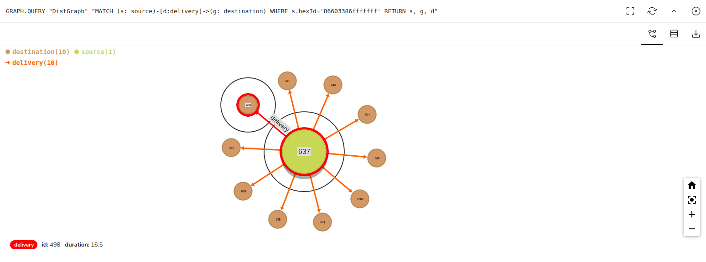

### Delivery Pickup Analysis with Food Delivery Data

This project includes creating graph with the restaurant and the grouped delivery locations with median value of delivery times,
creating ML model using delivery features (distance, traffic, weather condition etc.) to predict incoming order delivery time and using OSRM 
to find duration and distance of the optimal route. 


#### Setup OSRM with Docker (with the help of steps in https://hub.docker.com/r/osrm/osrm-backend/)

[Food Delivery Dataset](https://www.kaggle.com/datasets/gauravmalik26/food-delivery-dataset?datasetId=2515893&sortBy=dateRun&tab=profile) is on India map, so to get India information from OSRM first:

```angular2html
wget http://download.geofabrik.de/asia/india-latest.osm.pbf
```
File is in **<project_dir>/data**. project_dir is also current directory. To do so extract information from installed **_osm.pbf_** file:
```
docker run -t -v "${PWD}/data:/data" osrm/osrm-backend osrm-extract -p /opt/car.lua /data/india-latest.osm.pbf
```

After that, run:

```
docker run -t -v "${PWD}/data:/data" osrm/osrm-backend osrm-partition /data/india-latest.osrm
docker run -t -v "${PWD}/data:/data" osrm/osrm-backend osrm-customize /data/india-latest.osrm
```
**Note:** There must be enough space to execute Docker commands in your machine, otherwise Docker will exit with code **137 (out of memory)**.

- System Information <br><br>

    

Up OSRM backend with (in detach mode):
```
docker run -t -d -i -p 5000:5000 -v "${PWD}/data:/data" osrm/osrm-backend osrm-routed --algorithm mld /data/india-latest.osrm
```
- The meaning of .osm is OpenStreetMap and .pbf file is an alternative to XML format, has smaller size. 
It is used for GIS transfer.

#### Redis Graph for Delivery Grouping, Connections and Visualization

Dataset contains latitudes and longitudes of restaurant and delivery addresses in the original form. 
This information is converted to hexagon id (hex id) with using **H3** library to group delivery addresses in the same hex id and reduce the dimension. 
Also, for the future predictions for unknown locations, distance from source and destination locations are calculated and 
added to dataset as a column. It increases the success the **CatBoost Regressor** model.

- **Grouping:** There may be many orders between one restaurant and one delivery location in hexagon form, so to avoid multiple nodes 
represents one delivery id, grouping was a good choice. Median value of the delivery times take place as an edge attribute between source and destination nodes in the **Redis Graph**.
  (If the data were enough and suitable for time-based analysis, this median value could be updated hourly.) <br> <br>

  __*Example group result:*__

  

- **Connections:** At first, graph is constructed with initial data (in dataset) after grouping. If new delivery data comes, source-destination connection in the graph is examined:
  - If there is a connection already, data is sent to **OSRM backend** to increase the correctness of duration. OSRM returns optimal route duration after 
  compares all routes (with alternatives) durations with their time and distance parameters. Lastly, the **mean** of the edge duration and OSRM duration values is 
  used to update duration attribute of the edge. 
  - If there is no connection yet (for existing nodes. other conditions will be handled later), it means that there is no delivery between existing nodes. 
  The duration of delivery is found out by **CatBoost Regressor** model referencing the previous deliveries' features. Also, **OSRM** result is calculated for from-to locations
  and edge is created among nodes with the **mean** of the model prediction and the OSRM result. <br> <br>

  __*Example new edge creation for RedisGraph:*__ (yellow->source, orange->destination) <br><br>

  

  

  __*Example edge update for RedisGraph:*__ <br><br>

  

  

  


**A new Redis Graph would be created for each hour but there is no enough data for time series. Also, this data can be used to detect novelties with different techniques (ml, statistics etc.)**